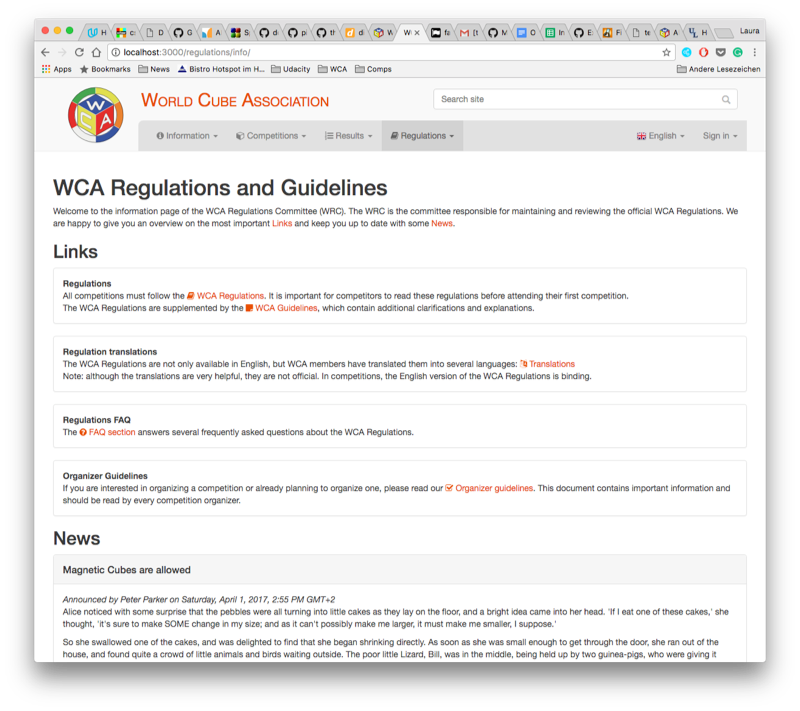
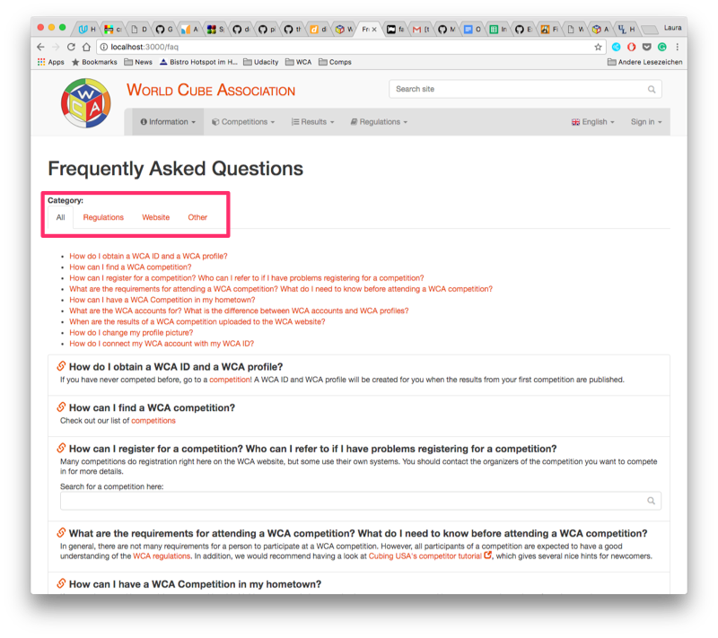
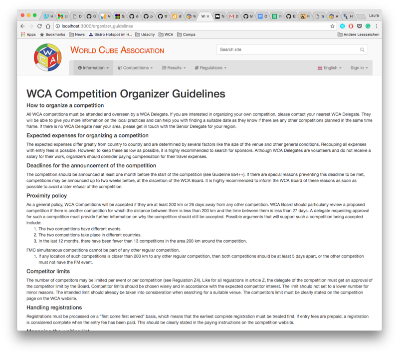
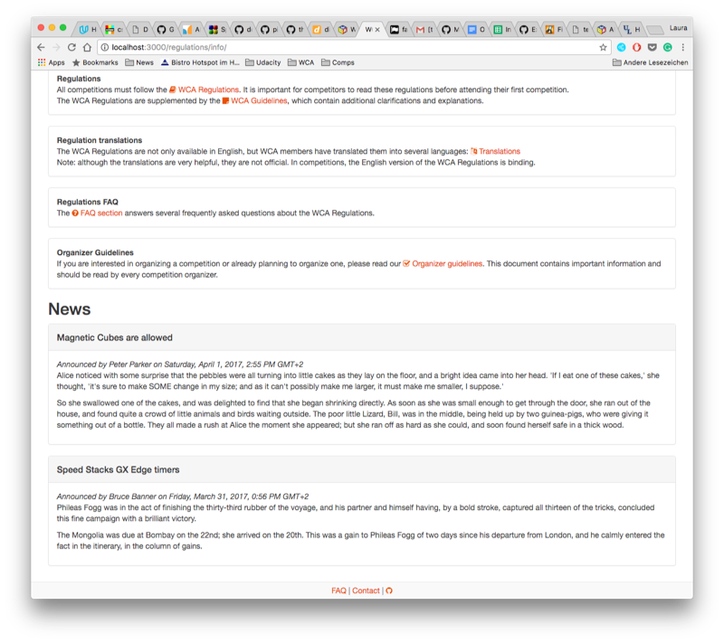
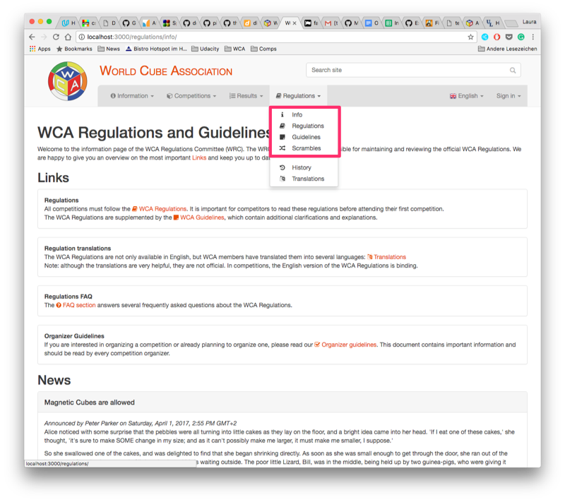

# WRC content on the WCA Website

## Overview: what we want to have (explanations below)
- Additional page linked in the Regulations menu in the navigation bar, with:
	- Short intro
	- Links to Regulations and Guidelines and short explanation
	- Link to Regulations translations and short explanation
	- Link to FAQ
	- Link to Hardware section (tbd)
	- Link to organizer guidelines
	- News section
- Embed WRC FAQs in [Website FAQ](https://www.worldcubeassociation.org/faq)
- Organizer guidelines
- Hardware page

## Additional page
To add all the content, we need a new page where we can structure and present everything. Naturally, this should be in the "Regulations" section of the navigation bar. For now, I have called this page "info".

As described above, the page has a short intro, links to the main regulation resources and then some WRC news.

[Link to full-size image](info.png)

## FAQ
We have collected the most common questions we received via email and compiled them as FAQs. They are still WIP, but should be done soon.

There is  already a FAQ section on the website. Adding another FAQ section for WRC questions would be bad: in the worst case, people who have general questions only read the WRC FAQs and vice-versa. Furthermore, some of the questions overlap or do not 100% fit into one category.

*My suggestion for a solution:* We can add the WRC questions to the general section. As we will probably end up with a total of 20-30 questions (including the existing ones), it would be nice to have an option to sort them in categories. 

[Link to full-size image](faq.png)

## Hardware section
On the long run, we would also like to have a hardware section, which contains information about puzzles. This section should not focus on specific models, but rather on examples and edge cases (see [GitHub issue #168](https://github.com/thewca/wca-regulations/issues/168)).

The implementation of the hardware section will take more time, for content as well as for the design. So this section will probably be added later.

## Organizer Guidelines
The Organizer Guidelines are plain text, structured in several paragraphs. The page could be structured like the existing FAQ section. But as this is a continuous text and it should be read as a whole, it might be better to leave it as a full text (see screenshot for an example).

[Link to full size-image](organizer_guidelines.png)

## News
The news section should be similar to the announcements on the front page. I think we do not need a form/interface to post them as we will only add something every 2-3 months. However, it might be nice to have an option to archive them, so that old news not shown on the page but are still available via a link.

[Link to full size-image](news.png)

## Other issues: icons
- The FA icon for the Guidelines should be changed from 'question-circle' to 'sticky-note'. I never thought about the icon used for the Guidelines, but a question mark is not the best representation. Therefore, I suggest to changing this to 'sticky-note'.
- For the new info page, 'info' looks nice.
- For the organizer guidelines, 'check-square-o' could fit (though it's not linked in the navigation bar).

[Link to full-size image](navbar.png)

## Translations
- Organizer guidelines: they should be preferably translated, as they are particularly interesting for competitors from regions with no or few WCA competitions (mainly non-English). However, it's a lot of content, and I am not sure if the website translators are willing to do this.
- WRC FAQs: like the general FAQs, they should be translated. They are not too long and are not likely to be changed often.
- News: this is dynamic content and will (hopefully) be updated frequently, so I think we do not need a translation.
